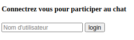
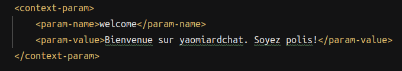
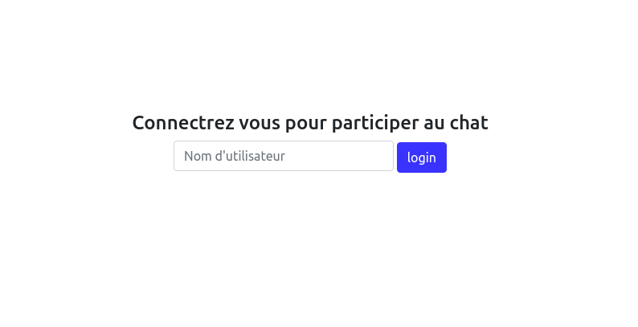
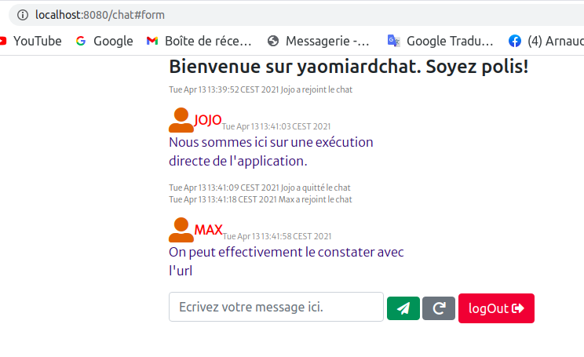
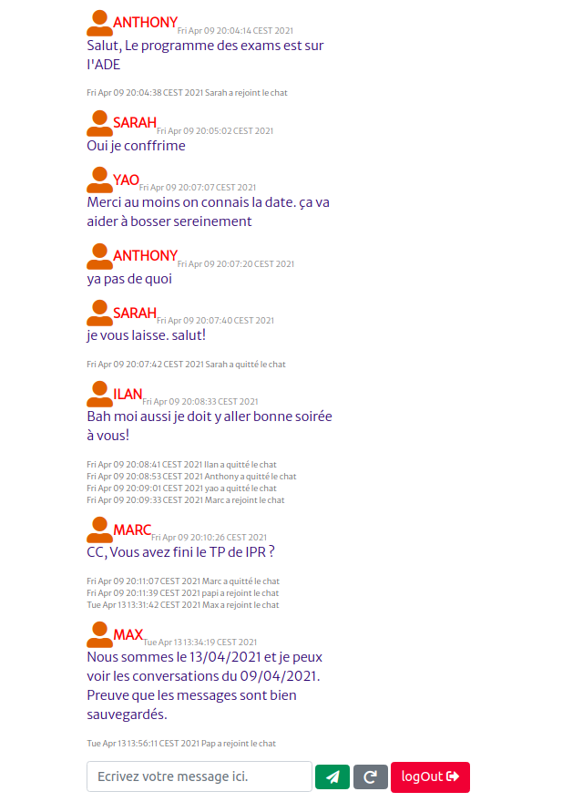

#  Les servlets
Yao-Arnaud Akoto, Anthony Amiard  

## Partie 1 : Chat anonyme

### Servlet `/chat`

- L'erreur 405 explique que la méthode HTTP GET n'est pas supportée par l'URL,
  car la méthode `doGet` de la servlet n'a pas été implémentée.
  
### Contenu
Le servlet du chat est La classe Chat. On y trouve le contenu des messages dans chatContent. La méthode init()" 
permet d'initialiser le servlet. Les méthodes `doGet` et `doPost` permettent de traiter les requêtes GET  et POST.
### Formulaire
Pour permettre aux utilisateurs d'interagir, nous avons ajouté un formulaire comportant un champ et deux boutons.
- `Envoyer` Permettant d'envoyer un message.
- `refresh` Permettant de rafraichir les messages.
## Partie 2 : Utilisation d'une JSP
Pour simplifier la maintenance du chat, nous avons séparé le HTML du traitement du contenu. Le HTML est donc généré par le fichier JSP `chat.jsp`
## Partie 3 : SESSIONS
Pour gérer les sessions, on a créé un formulaire de connexion dans un fichier `auth.jsp`.

Lorsqu'un utilisateur essaie de se connecter au chat, le servlet vérifie si la 
session contient l'attribut user. Si ce n'est pas le cas, il est redirigé vers la page de connexion.
## Partie 4 : Configuration du message de bienvenue
Pour configurer le message d'accueil, nous avons ajouté le paramètre suivant à notre application :

Ensuite, la modification de la méthode `init` a permis sa prise en compte.
## Pour aller plus loin
Nous avons apporté des améliorations à notre application :
- l'ajout de `style`
- l'ajout de bouton `logOut`
- création de `war` permettant de lancer l'application sans IDE.
- sauvegarde de la conversation à l'arrêt du serveur.
  
  
  
  
    
  

